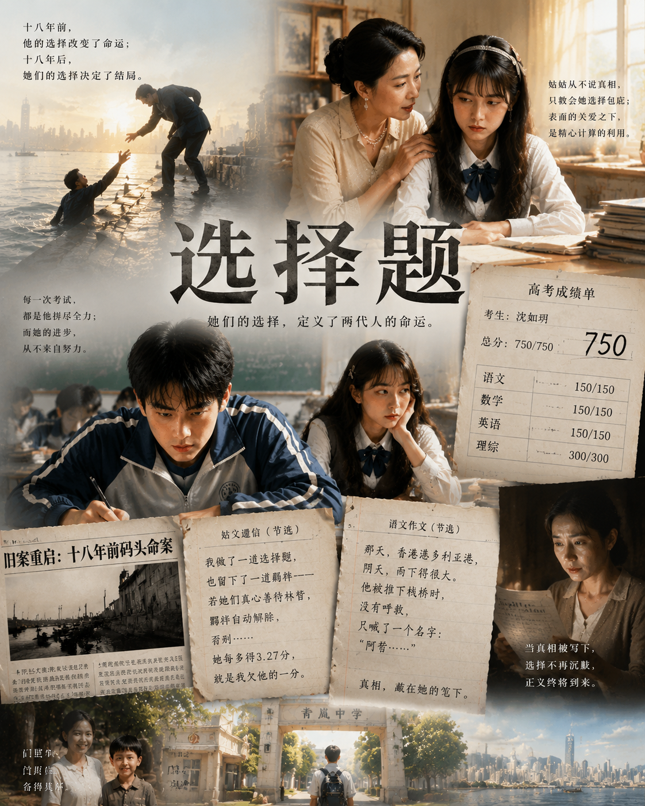

# 选择题

**作者：小迪**

---

> 贫寒少年林哲被姑姑资助进入省城高中，却发现表妹沈如玥的成绩诡异同步于自己。十八年前的一桩命案、一道关于选择与贪心的羁绊，正在考场上慢慢揭晓答案。

---

林哲从小在胡同里长大，和母亲相依为命，从未见过父亲。他拼命学习，终于考上省城最好的青岚中学。姑姑在省城嫁入了富裕的沈家，主动提出资助他上学。

然而从第一次月考开始，一件诡异的事发生了——从不学习的表妹沈如玥，成绩竟与他完全同步。

十八年前，香港码头。两个男人、一笔钱、一根一根被掰开的手指。父亲临死前喊的不是救命，是儿子林哲的名字。

姑父临死前留下了一道"羁绊"：林哲每参加一次考试，沈如玥的成绩就自动增加 3.27 分。但如果姑姑和沈如玥真心善待林哲，羁绊自动解除。

这不是诅咒。这是一道选择题。

而她们，从头错到了尾。
